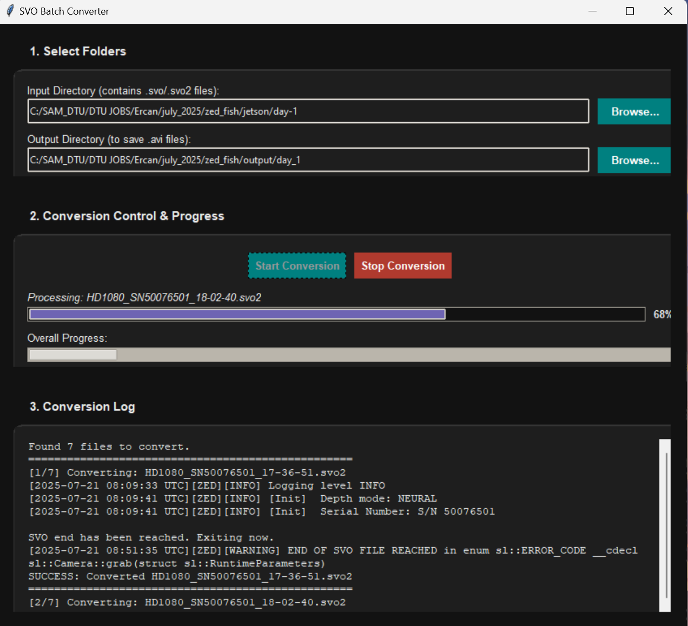

## SVO to AVI batch Converter app for ZED camera systems

This tool provides a simple and efficient workflow for processing multiple .svo or .svo2 files, saving you from the tedious task of converting them one by one through the command line.
The main conversion script is made by the stereolabs. You can also clone the zed-sdk repository from [here](https://github.com/stereolabs/zed-sdk.git). 

You can find the main svo to avi conversion script in the following path of the zed-sdk repository of stereolabs. But i have added the script in this repository.

```txt
zed sdk -> recording -> export -> svo -> python -> svo_export.py
```



## Features
- Batch Conversion: Process an entire folder of .svo and .svo2 files in one go.

- Modern UI: A sleek, full-black user interface with custom-drawn rounded frames.
- Real-time Progress:
   - An overall progress bar tracks the entire batch of files.
   - A per-file progress bar shows the status of the current conversion.
- Dynamic Progress Bar: The current file's progress bar animates with a color gradient from red to blue for a clear visual indicator.
- Full Control: A Start/Stop button allows you to begin and interrupt the conversion process at any time.
- Clean Log Output: A dedicated log panel shows important status messages and errors without being cluttered by raw progress data.

--------------------------------------------------------------------------------------------------------------------------------------------------
## Requirements
Before you begin, ensure you have the following installed:

- Python 3.x

- ZED SDK: This is the most crucial requirement. You must install the SDK from the Stereolabs website.

  - ➡️ Download the [ZED SDK](https://www.stereolabs.com/en-dk/developers/release/5.0).
  - Important: During the ZED SDK installation, make sure to install the Python API. follow the instructions of the documentation in the official website of the stereolabs website
  - [ZED documentation - Python](https://www.stereolabs.com/en-dk/developers/release/5.0](https://www.stereolabs.com/docs/development/python/install)).
    

- Required Python Libraries:
    - pyzed (This is installed with the ZED SDK's Python API)
    - opencv-python
    - numpy
    - Pillow
-----------------------------------------------------------------------------------------------------------------------------------------------------------

## Setup and Installation

Follow these steps to get the project running on your local machine.

1. Clone the Repository
First, clone this repository to your computer using Git:

```bash
git clone <repository-url>
cd <path to the cloned repository>
```

2. Verify ZED SDK and Python API
Ensure your ZED SDK and the pyzed wrapper are installed correctly. You can test this by trying to import the library in a Python shell:

```python
import pyzed.sl as sl
```
If you don't get an error, you're good to go. If you do, please reinstall the ZED SDK and ensure you select the Python API for your Python version during setup.

3. Install Python Dependencies
The svo_export.py script requires OpenCV and NumPy. You can install them using pip:

```bash
pip install opencv-python numpy Pillow
```

--------------------------------------------------------------------------------------------------------------------------------------------------------------

## How to Use 
1. File Placement: Make sure both svo_export.py and batch_converter_gui.py are in the same directory.
2. Run the Application: Open your terminal, navigate to the project directory, and run the GUI script:

```bash
python batch_converter_gui.py
```
3. Select Folders:

  - Click "Browse..." to select the Input Directory containing your .svo or .svo2 files.
  - Click "Browse..." again to select the Output Directory where the converted .avi files will be saved.

4. Start Converting
  - Click the "Start Conversion" button.
  - Watch the progress bars and log update in real-time.
  - If you need to interrupt the process, click the red "Stop Conversion" button.
--------------------------------------------------------------------------------------------------------------------------------------------------------------
## File Structure

- svo_export.py: The original command-line conversion script provided by Stereolabs. This script is called as a subprocess by the GUI for each file.
- batch_converter_gui.py: The main application file that provides the graphical user interface and batch processing logic. This is the file you run.
- README.md: This file.

--------------------------------------------------------------------------------------------------------------------------------------------------------------

## License
- The batch converter GUI (batch_converter_gui.py) is released under the MIT License.
- Please note that the svo_export.py script is provided by Stereolabs and is subject to its own license, which can be found in the header of the file.


